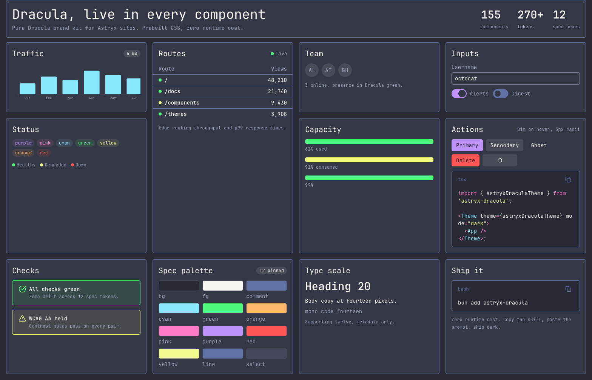

# Dracula for [Astryx](https://astryx.atmeta.com/)

> A dark theme for [Astryx](https://astryx.atmeta.com/).

## Install

All instructions can be found at [draculatheme.com/astryx](https://draculatheme.com/astryx).

You can also follow the repository's detailed [installation guide](./INSTALL.md).

## Features

- A dark-only Astryx theme based on the official Dracula palette.
- Prebuilt Astryx theme and plain CSS token entry points.
- Dracula syntax highlighting, semantic status colors, and chart palettes.
- JetBrains Mono fonts and a Lucide icon registry.

## Documentation

- [Installation](./INSTALL.md) covers package, Git, and manual setup.
- [Usage](./docs/usage.md) covers integration options and troubleshooting.
- [Brand reference](./docs/brand.md) documents the palette and semantic decisions.

## Team

This theme is maintained by the following person(s) and a bunch of [awesome contributors](https://github.com/dracula/astryx/graphs/contributors).

|  |
| ------------------------------------------------------------------------------------------------ |
| [yuzu-octopus](https://github.com/yuzu-octopus)                                                  |

## Community

Join thousands of vampires using Dracula Theme around the world 🦇

- [X (Twitter)](https://x.com/draculatheme) and [Instagram](https://www.instagram.com/draculatheme) - Follow for tips, news, and fun.
- [Discord](https://draculatheme.com/discord-invite) - Hang out and chat with the rest of the clan.
- [GitHub Discussions](https://github.com/dracula/dracula-theme/discussions) - Ask questions and discuss issues.

## Dracula PRO

## License

[MIT License](./LICENSE)

---

*Source and releases: [yuzu-octopus/astryx-dracula](https://github.com/yuzu-octopus/astryx-dracula)*
